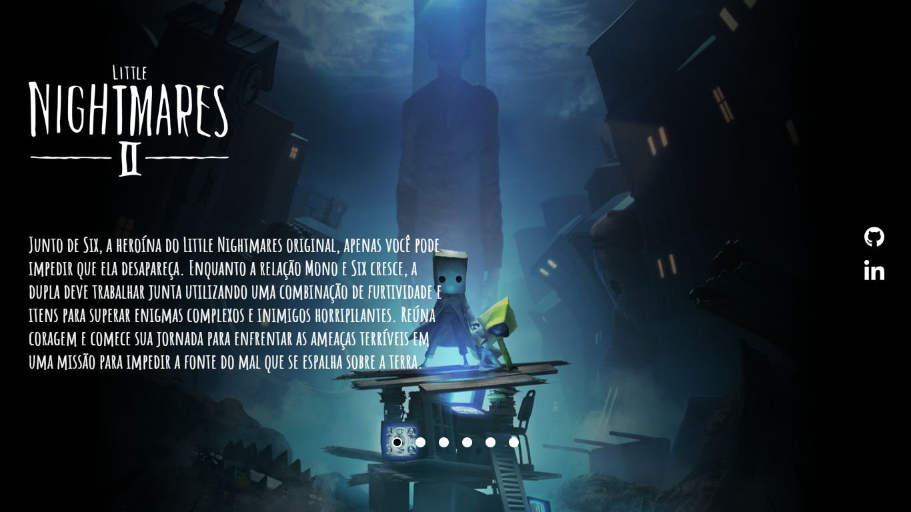

<h1 align="center"> Little Nightmares II - Synopsis</h1>

project aimed at electronic game companies and the gamer community.  

  <a href="#-Preview">Preview</a>&nbsp;&nbsp;&nbsp;|&nbsp;&nbsp;&nbsp;
  <a href="#-tecnologias">technologies</a>&nbsp;&nbsp;&nbsp;|&nbsp;&nbsp;&nbsp;
  <a href="#-projeto">Project</a>&nbsp;&nbsp;&nbsp;&nbsp;&nbsp;&nbsp;

 

## 🔖 Preview

see the preview of the project:

## 🚀 technologies

This project was developed with the following technologies:

- HTML e CSS
- JavaScript
- Git e Github

## 💻 Project

The project and synopsis of the game Little Nightmare II. 

- [Visit the project online] ()

---

Made with ♥ 
 
Daniel Nicolas Leoterio
